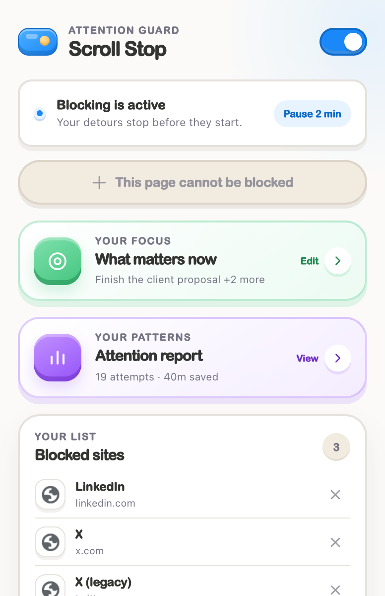
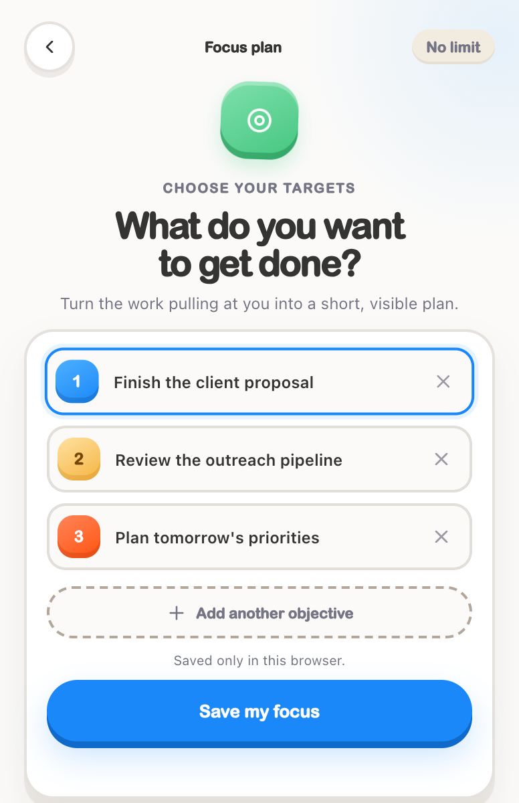
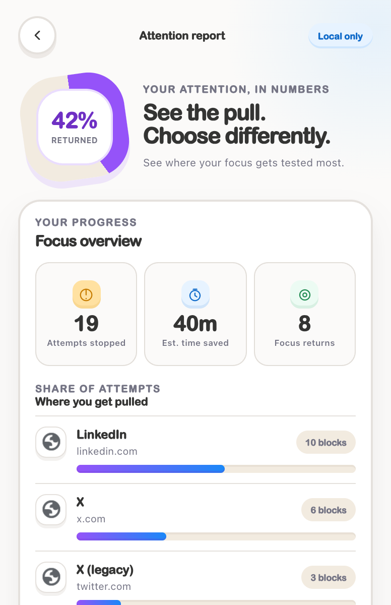

<p align="center">
  
</p>

# Scroll Stop

Scroll Stop is an open-source Chrome extension that interrupts distracting websites before the scroll starts. It brings your chosen focus goals back into view, adds two moments of reflection before a short break, and keeps a private attention report on your device.

LinkedIn, X, and the legacy Twitter domain are blocked by default. Add or remove any public website from the popup.

## What it does

- Redirects blocked websites to a local reminder before their pages load.
- Redirects blocked tabs that were already open when blocking is enabled again.
- Shows the objectives you chose in the Focus Plan.
- Requires two reflection steps before granting a 2-minute break.
- Keeps each blocked-page break limited to the website that requested it.
- Counts blocked attempts by website.
- Shows focus returns, estimated time saved, and per-site charts.
- Stores settings and analytics only in local Chrome storage.
- Uses Chrome's local favicon cache to show each blocked website's icon.
- Makes no API calls and requires no account, API key, or subscription.

## Screenshots

<table>
  <tr>
    <td align="center"><strong>Main popup</strong></td>
    <td align="center"><strong>Focus Plan</strong></td>
    <td align="center"><strong>Attention Report</strong></td>
  </tr>
  <tr>
    <td></td>
    <td></td>
    <td></td>
  </tr>
</table>

The current Focus Plan supports unlimited objectives. Its marker colors continue cycling as more objectives are added.

## Install in Chrome

No build step is required.

1. Download or clone this repository from `https://github.com/filipelinsduarte/scrolling-stop`.
2. If you downloaded a ZIP file, unzip it.
3. Open `chrome://extensions` in Google Chrome.
4. Turn on **Developer mode** in the top-right corner.
5. Click **Load unpacked**.
6. Select the folder containing `manifest.json`.
7. Pin Scroll Stop from Chrome's Extensions menu.

If Chrome still shows an older orange icon, click **Reload** on the Scroll Stop card in `chrome://extensions`. If it remains cached, remove the old unpacked copy and load this folder again. Version 1.4.1 and newer use new blue icon filenames specifically to clear the old cache.

## Install with Claude or Codex

Copy and paste this into your coding agent:

```text
Clone or download https://github.com/filipelinsduarte/scrolling-stop into a normal local folder. Read skills/install-scroll-stop/SKILL.md from the cloned repository completely, then follow it to install Scroll Stop in Chrome. Do not ask for API keys because this extension does not use any. Preserve my existing files, run the included checks if Node.js is available, and give me the exact final Chrome steps for Load unpacked.
```

For repeated use, copy the [`skills/install-scroll-stop`](skills/install-scroll-stop) folder into your Claude or Codex skills directory, then ask:

```text
Use $install-scroll-stop to install and customize Scroll Stop in Chrome.
```

## Use Scroll Stop

- Click **Set focus** to define as many objectives as you need.
- Click **Attention report** to open the dedicated analytics view.
- Click **Block this site** while visiting another website to add it.
- Remove websites from the Blocked sites list.
- Use **Go back** when a blocked site interrupts you.
- If access is genuinely needed, complete both reflection prompts to start a 2-minute break.

Newly added websites use their favicon from Chrome's local favicon cache. The challenge copy also uses the website that triggered the interruption. For example, `reddit.com` appears as Reddit, `youtube.com` appears as YouTube, and custom domains receive a readable name derived from their domain.

## Privacy

The extension requests website access so Chrome can redirect domains from your blocked list. It does not read page content, collect browsing history, contact an external server, or transmit analytics. Focus goals, blocked domains, and attention statistics remain in `chrome.storage.local` on the current Chrome profile.

The time-saved number is an estimate of 5 minutes for each explicit **Return to my focus** action. A blocked-page arrival counts as an attempt, but it does not count as time saved by itself.

## Development

Requirements for development checks:

- Node.js 20 or newer
- npm
- Chromium installed through Playwright for the browser verification

```bash
npm install
npm test
npx playwright install chromium
npm run verify
npm run verify:landing
```

The unit suite covers domain normalization, open-tab matching, redirect attribution, dynamic website copy, analytics calculations, focus goals, the two-step break challenge, and serialized rule updates. The browser verification loads the unpacked extension in an isolated Chromium profile and checks the complete popup, favicon, and redirect flows.

## Project structure

```text
manifest.json                 Chrome extension manifest
service-worker.js             Storage, timers, analytics, and redirect rules
popup.html / popup.js         Popup and its Focus and Analytics views
blocked.html / blocked.js     Interruption and break-challenge flow
src/                          Pure tested logic
styles/                       Shared Toy Grade visual system
tests/                        Vitest unit tests
scripts/verify-extension.mjs  Isolated Chromium end-to-end verification
scripts/verify-landing.mjs    Responsive landing-page browser verification
docs/                         GitHub Pages landing page and extension download
skills/install-scroll-stop/   Copyable Claude and Codex installation skill
```

## Contributing

Issues and pull requests are welcome. Read [CONTRIBUTING.md](CONTRIBUTING.md) before submitting a change.

## License

MIT, see [LICENSE](LICENSE).
